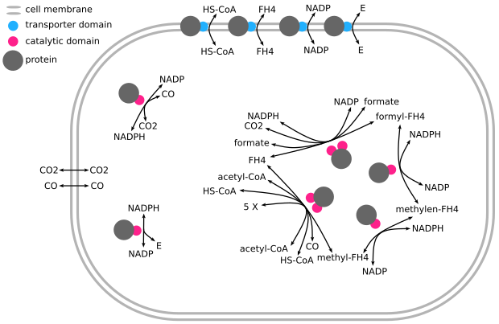

# Carbon Fixation

In this simulation cells are brought to fix CO2 from the environment.
For this the world was defined with a chemistry resembling 6 major CO2-fixing metabolic pathways.
Cells are grown in media with CO2 and energy.
Evolutionary pressure is applied by killing cells with low energy levels
and replicating cells with high levels of fixed carbon.
Fixed carbon is defined by molecule species such as acetyl-CoA.

- [Chemistry](./docs/chemistry.md) all molecule species and reactions
- [Experimental Setup](./docs/setup.md) cell selection, culturing methods, and other methods
- [Wood-Ljungdahl Pathway Runs](./docs/WL_training.md) WL training run results

_**WL result cells**. Illustration summarizing about 70% of all cells after being cultured to develop the Wood-Ljungdahl pathway._

([back to top](#carbon-fixation))