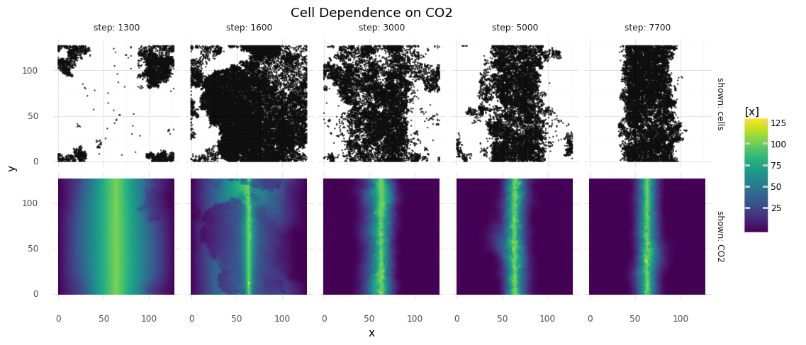

# Carbon Fixation

Here, I am trying to bring the cells to fix CO2.
A chemistry representing the [Wood Ljungdahl pathway](https://www.ncbi.nlm.nih.gov/pmc/articles/PMC2646786/) is defined.
Under energy expenditure CO2 can acetylate HS-CoA within 6 steps.

In this simulation replication probability is tied to intracellular acetyl-CoA concentrations and acetyl-CoA is converted to HS-CoA when a cell replicates.
This should make cells find a way to constanly replenish acetyl-CoA.
New CO2, and energy in the form of ATP and NADPH is provided in abundance.


_World map for cells and CO2 is shown. Columns represent different time steps of the simulation, the top row shows cells, the bottom row shows CO2 concentrations. CO2 is constantly replenished on the vertical middle-line, creating a gradient. First, cells grow randomly over the map, exhausting acetyl-CoA. Then, most cells die. Only cells that know how to replenish acetyl-CoA from CO2 and that are close to the CO2 source survive._

- [main.py](./main.py) runs the simulation
- [runs/](./runs/) saved runs (in gitignore)
- [analyze_2023-01-17_21-45.ipynb](./analyze_2023-01-17_21-45.ipynb) cells formed a stable colony, but they enlarged their genomes without end

```
# init world
python -m e1_co2_fixing.main init

# short test run:
python -m e1_co2_fixing.main --n_steps=21 --n_trials=1
...
# proper run on GPU:
python -m e1_co2_fixing.main --init --device=cuda
python -m e1_co2_fixing.main --device=cuda
...
# watch progress on tensorboard
tensorboard --host 0.0.0.0 --logdir=./e1_co2_fixing/runs
```

## Chemistry

I wanted to have a diverse set of reactions that would allow different
possibilities to fix carbon to some biologically useful molecule.
I started by extracting reactions and molecule species from _Gong, Fuyu & Cai, Zhen & Li, Yin. (2016). Synthetic biology for CO2 fixation_.
These are 6 carbon fixing pathways.
Molecules _G3P_, _acetyl-CoA_, and _pyruvate_ are the carbon carriers that the cell will consume to replicate.
I added a molecule species _X_ and reactions for how these carbon carriers can be converted to _X_.
With _X_ I have a single handle that can be used during the simulation.

Energy is provided by _NADPH_ and _ATP_.
If a reaction needed an electron donor I explicitly added $\text{NADPH} \rightleftharpoons \text{NADP}$.
If it needed a phophate group I explicitly added $\text{ATP} \rightleftharpoons \text{ADP}$.
Other reactions are defined without energy carriers, so that the cell can create its own way of driving the reaction.
To restore energy carriers I added a molecule species _Y_ and reactions with _Y_ to restore _NADPH_ and _ATP_.
Similar to _X_, _Y_ can be used as a handle to restore energy during the simulation.
