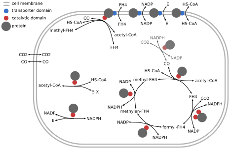

# Carbon Fixation

In this simulation cells are brought to fix CO2 from the environment.
For this the world was defined with a chemistry resembling 6 major CO2-fixing metabolic pathways.
Cells are grown in media with CO2 and energy.
Evolutionary pressure is applied by killing cells with low energy levels
and replicating cells with high levels of fixed carbon.
Fixed carbon is defined by molecule species such as acetyl-CoA.

- [Chemistry](./docs/chemistry.md) all molecules species and reactions
- [Experimental Setup](./docs/setup.md) cell selection, culturing methods, and other methods
- [Wood-Ljungdahl Pathway Runs](./docs/WL_training.md) WL training run results

_Illustration of final cells that were able to grow in a Chemostat on CO2 and energy alone. Cells developed a proteome resembling the Wood-Ljungdahl pathway. This is a summary proteome describing about 70% of cells. Rare and inactive proteins were left out. Only about 30% of cells have a protein to convert CO2 to CO. The others rely on passive CO-uptake._

([back to top](#carbon-fixation))