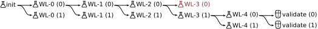

# Carbon Fixation

In this simulation cells are brought to fix CO2 from the environment.
For this the world was defined with a [chemistry](#chemistry) resembling 6 major CO2-fixing metabolic pathways.
Cells are grown in media with high CO2 and energy content.
Evolutionary pressure is applied by killing cells with low energy levels
and replicating cells with high levels of fixed carbon.
Fixed carbon is defined by molecule species such as acetyl-CoA.


_Illustration of final cells that were able to grow in a Chemostat on CO2 and energy alone. Cells developed a proteome resembling the Wood-Ljungdahl pathway. This is a summary proteome describing about 70% of cells. Rare and inactive proteins were left out. Only about 30% of cells have a protein to convert CO2 to CO. The others rely on passive CO-uptake._

- [Chemistry](#chemistry)
- [Experimental Setup](#experimental-setup)
- [Wood-Ljungdahl Training](#wood-ljungdahl-training)
- [Run](#run)
- [Lessons Learned](#lessons-learned)

Runs:

- `train-pathway_*` WL pathway training runs.
  Summary [docs here](./docs/pathway_training.md).
  Training overview plots [by step](./imgs/pathway-training-by-step.png)
  and [by generation](./imgs/pathway-training-by-generation.png).
  Plot describing [all cells of final state](./imgs/train-pathway_2024-01-15_16-57_0_step=1073_all_cells.png).
- `grow-batch_2024-01-15_17-07_*` batch culture run with successful cells from WL training.
  Run overview plots [by step](./imgs/grow-batch_2024-01-15_17-07_0_run-by-step.png)
  and [by generation](./imgs/grow-batch_2024-01-15_17-07_0_run-by-generation.png).
  Plot describing [all cells of final state](./imgs/grow-batch_2024-01-15_17-07_0_step=1086_all_cells.png).
- `grow-batch_2024-01-15_17-17_*` batch culture with random cells as comparison.
  Run overview plots [by step](./imgs/grow-batch_2024-01-15_17-17_0_run-by-step.png)
  and [by generation](./imgs/grow-batch_2024-01-15_17-17_0_run-by-generation.png).
- `grow-chemostat_2024-01-15_17-43_*` chemostat run with successful cells from WL training.
  Run overview plots [by step](./imgs/grow-chemostat_2024-01-15_17-43_0_run-by-step.png)
  and [by generation](./imgs/grow-chemostat_2024-01-15_17-43_0_run-by-generation.png).
  Plot describing [all cells of final state](./imgs/grow-chemostat_2024-01-15_17-43_0_step=3234_all_cells.png).
- `grow-chemostat_2024-01-15_18-04_*` chemostat run with random cells as comparison.
  Run overview plots [by step](./imgs/grow-chemostat_2024-01-15_18-04_0_run-by-step.png)
  and [by generation](./imgs/grow-chemostat_2024-01-15_18-04_0_run-by-generation.png).


## Chemistry

The world's chemistry defines molecule species and reactions that can occur.
The 6 CO2-fixing pathways described in [Gong, 2016](https://link.springer.com/article/10.1007/s11427-016-0304-2)
were used as basis for reactions.
The pathways were simplified in some cases to reduce the overall number of involved molecule species
without limiting the diversity and possible interplay of these pathways.
One such simplification was to only use NADPH and ATP as high-energy electron and phosphate donors.

The output of each pathway is a biologically useful carbon carrier.
_E.g._ for the Wood-Ljungdahl pathway it is acetyl-CoA.
For each carbon carrier, an additional reaction was defined in which the carbon carrier
generates a new molecule species $X$.
_E.g._ one additional reaction is $\text{acetyl-CoA} \rightleftharpoons \text{HS-CoA} + 5 X$.
Thus, $X$ levels in the cell can be used a handle to measure how much carbon the cell has fixed.

As cells have no means of regenerating NADPH or ATP, an additional molecule species $E$ and 2 additional reactions were defined.
With $2 \text{ADP} + E \rightleftharpoons 2 \text{ATP}$ and $\text{NADP} + E \rightleftharpoons \text{NADPH}$
there is the possibility of regenerating ATP and NADPH.
Thus, $E$ represents available energy for a cell.

These reactions were defined together with all involved molecule species.
Cells can create proteins with catalytic domains for each reaction,
transporter domains for each molecule species, and regulatory domains for each molecule species.
Thus cells can either recreate one of these 6 pmetabolic pathways, or
create a new metabolic pathway by combining these reactions in a new way.
Energy levels of molecule species were set in a way that these 6 metabolic pathways
are thermodynamically possible and have roughly the same reaction energies.
All molecule species recieved a moderate diffusivity and 0 permeability.
Only CO2 was given a high diffusivity and high permeability.
See [chemistry.py](./chemistry.py) for details.

([back to top](#carbon-fixation))

## Experimental Setup

One simulation run represents a one experiment in which certain cells are cultured
in a specific medium with certain interventions.
Each simulation run is repeated in trials multiple times.
In the simulation time advances step-by-step, incrementally calculating protein activities,
diffusion and permeation, and resulting molecule changes at each step.
Reaction velocities are calibrated in a way that 1 step could represent 1 second.
However, protein transcription and translation, as well as cell death and replication
happen instantaneously.
Thus, simulated cells grow and evolve much faster than their real-live equivalents.

### Cell Growth

During each step a cell can replicate and/or die.
At each step probability distribution functions
calculate probabilities for each cell for replication and dying.
The decision of whether a cell actually replicates or dies is sampled
with the calculated probability.

There are 3 probability distribution functions.
A function $p_x = [X]^{n_x} / ([X]^{n_x} + k_x^{n_x})$ calculates the probability
of replication for a cell based on its $X$ molecule contents,
$p_e = k_e^{n_e} / ([E]^{n_e} + k_e^{n_e})$ calculates the probability of dying
for a cell based on its $E$ molecule contents,
$p_s = s^{n_s} / (s^{n_s} + k_s^{n_s})$ calculates the probability of dying
for a cell based on its genome size $s$.
Initial ranges for $n_x, n_e, n_s$ and $k_x, k_e, k_s$ were estimated in [prep.ipynb](./ipynb),
concrete values were found by trial-and-error when running simulations.
They were set in a way that it is hard but not impossible for cells to grow.

### Culturing Systems

In the simulation the `world` represents a flask or plate in which the cells grow.
It's molecule contents represent the growth medium.
2 basic culturing systems are used: _Batch culture_ and a _Chemostat_.

During **batch culture** cells are placed and growth medium is set initially.
Then, cells are left to grow.
This means the contents of the growth medium change as cells grow.
Batch culture is usually coupled with passaging of cells.
If the number of cells exceeds a certain threshold (almost all of the `world` is overgrown with cells),
fresh growth medium is prepared and a randomly selected subset of cells is placed
in the fresh growth medium.
This culturing strategy can keep cells indefinitly in exponential growth phase.
It strongly selects for fast-growing cells.

In a **Chemostat** growth medium is continuously adjusted.
Fresh medium is continuously added while left over medium is removed.
This means a stable nutrient gradient can arise while cells grow.
Here, this is implemented by continously setting fresh medium in the middle of the `world`
while removing all medium on the edge of it.
This creates a nutrient gradient which is high in the middle and falls to zero toward the edges.

([back to top](#carbon-fixation))

## Wood-Ljungdahl Training

Cells were trained to create a proteome that represents a WL pathway in 5 stages.
In each stage cells were grown in batch culture with 3 phases:
an initial, a training, and a final phase.
For each stage 2 trials were run.
The minimal medium of one stage would be the initial medium of the next.
The initial cells of one stage were the successful cells of the previous stage.
This way cells' proteomes grew with every stage until they could finally generate molecule $X$ from $CO2$ and $E$ alone.



_**Training Strategy** Cells were trained to evolve a WL pathway in 5 stages WL-0 to WL-4 with 2 trials each. Only cells of successful trials proceeded to the next stage. Finally, cells of successful WL-4 were validated in medium with only CO2 and energy. Validation was run in a Chemostat. All other runs were performed in batch culture._

The initial phase consists of a medium in which cells can grow continously.
_I.e._ cells already possess the required proteins to metabolize nutrient to molecule $X$.
Then, in the training phase, some nutrients are removed from the medium so that cells need additional proteins to create these nutrients.
At the same time cells were given new genes for exactly these proteins.
Additionally, overall mutation rate is increased during this phase.
Finally, in the last phase, cells must continue to grow in this minimal medium at normal mutation rates.
To successfully pass one phase, cells must grow at a sufficiently high average growth-rate for a minimum number of passages.
(See [WL_STAGES in chemistry.py](./src/chemistry.py) for the exact composition of each stage)


_**Training overview** Total cells, average growth rate, and genome size over steps. Cells were passaged to 20% whenever they covered 70%. Each stage had 3 phases: First, growth in medium of the previous stage with low mutation rate; Second, growth in medium lacking nutrients with high mutation rate; Third, growth in the same medium with low mutation rate. In the second phase each cell recieved genes to produce lacking nutrients. Cell proceeded to the next phase after growing a minimum number of passages at a high enough rate._

Cells that successfully passed stage 4 were grown once more in a Chemostat with continuous $CO2$ and $E$ supply for about 30 generations.
Cells started to reduce their genome sizes during this time.
Proteome analysis revealed that cell clusters formed around certain regions of the map.
Most domains related to the Wood-Ljungdahl pathway were however present in all of them.
The figure below shows a summary of this part of their proteomes.


_**Resulting proteomes** Illustration of final cells that were able to grow in a Chemostat on CO2 and energy alone. Cells developed a proteome resembling the Wood-Ljungdahl pathway. This is a summary proteome describing about 70% of cells. Rare and inactive proteins were left out. Only about 30% of cells have a protein to convert CO2 to CO. The others rely on passive CO-uptake._

One domain -- that catalyzing $\text{CO2} + \text{NADPH} \rightleftharpoons \text{CO} \text{NADP}$ -- was rarely found.
It turns out that only a few cell clusters possess this domain.
The other cells rely on external $CO$ production and passive $CO$ import.

([back to top](#carbon-fixation))

## Run

- [run.py](./run.py) entrypoint for the simulation
- [src/chemistry.py](./src/chemistry.py) world's chemistry definition
- [src/culture.py](./src/culture.py) cell culturing algorithms
- [src/generators.py](./src/generators.py) generators to influence culturing conditions
- [runs/](./runs/) saved runs (in gitignore)
- [prep.ipynb](./prep.ipynb) estimating useful hyperparameter ranges

```
python -m e1_co2_fixing.run --help  # follow help texts
...
tensorboard --host 0.0.0.0 --logdir=./e1_co2_fixing/runs
```

([back to top](#carbon-fixation))

## Lessons Learned

### Resupply of Additives

Many runs were wasted medium that did not include a re-supply of additives.
Of course the aim is to bring cells to grow on CO2 and E alone.
However, there are also additive molecules like NADP, ADP, HS-CoA, FH4, RuBP which cells cannot create
(at least not with this chemistry).
As a cell divides, the descendant cells will have each half the amount of these additives.
Sooner or later, they need to import these molecules from the environment.
Theoretically, a cell that dies would release its additives back to the environment.
However, over time (steps) the amount of additives in the system will still decrease.
Firstly, they degrade.
Secondly, in batch culture only a few cells are carried over during a passage.
So, some additives are lost during every passage.
In any case, I need to re-supply additives regularly and cells also need importers for these additives.

### Evolutionary Pressure and Molecule Abundance

In earlier runs I had the misconception that as molecule X is decreased (in medium)
evolutionary pressure on cells to recreate this molecule increases.
So, _e.g._ as I decrease NADPH, cells are pressured to create NADPH from NADP and E by themselves.
This might be true qualitatively, but I cannot assume that it follows a linear trend.
_I.e._ if I start with 1mM NADPH and linearly reduce it to 0mM NADPH over the course of 100 generations
that doesn't mean that evolutionary pressure builds up over 100 generations and linearly gets stronger.
_E.g._ maybe cells are still fine with 0.01mM NADPH.
In that case evolutionary pressure would only start at the very end of this linear slope.
Then, cells would only have a few generations left to adapt before 0mM NADPH.
So, if I start removing some important molecule from the medium,
I generally must assume that I don't know at what point cells are actually impacted by that loss.

One way of estimating whether cells are actually impacted could be by looking at their growth rate.
If the growth rate suddenly drops, the medium change probably had an effect on them.
In later runs I always included a stage gate process.
Cells had to first regain a certain minimum growth rate before the adaption process continued.

### Cells Throw Away Genes

This is somewhat related to the above.
In early runs I gave cells some genes they would need, and then started to linearly adjust the medium.
_E.g._ I would give them a gene to catalyze $\text{NADP} + \text{E} \rightleftharpoons \text{NADPH}$,
and then start reducing NADPH to 0mM, assuming they would start using that gene.
The problem is, cells are quick to throw away genes they don't need (or inactivate the CDS).
Now, cells get this new gene, but NADPH is still high enough (say 0.01mM).
They rather throw this gene away and get more efficient and using the remaining NADPH.
I saw that a few steps after I gave them the gene >80% of cells already lost it.

In later simulations I always immediately removed the associated additive when I gave them the new gene.
This means cells don't have a lot of time (steps) to adjust their proteome (and many cells immediately die)
but the overall success rate is much higher.

### Careful with Mutation Rates

In [prep.ipynb](./prep.ipynb) I tried to get good starting estimates for all hyperparameters.
The basic mutation rate was set to 1 mutation per million base pairs per step.
This seems reasonable.
However, for a high mutation rate (as used during training) I though a 100 times higher mutation rate would be good.
For most simulation I kept this high mutation rate.
It worked during easy training stages.
However, during difficult training stages, cells would always die.
After investigating how cells proteomes evolved during the adaption phases I realized that their proteomes are just all over the place.
Every gene gets mutatated almost every step.
They often loose entire genes.
It's a miracle they even got through the easy stages.
I was more successful with only a 10 times higher mutation rate.
Maybe even reducing the base rate by 10 times might be good, too.


([back to top](#carbon-fixation))